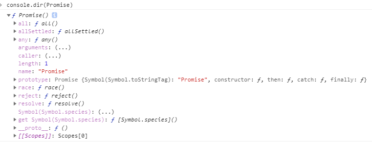

---
categories:
  - coding
tags:
  - js
date: 2020-05-12
title: es6 promise
---

## promise

`Promise`是一个构造函数，自己身上有`all、reject、resolve`这几个眼熟的方法，原型上有`then、catch`等同样很眼熟的方法。



## 解决异步回调地狱 a->b,事件触发，回调

es5

``` js
let ajax = function(callback){
    console.log('进入')
    setTimeout(()=>{
        callback && callback()
    },1000)
} 
ajax(()=>{
    console.log('回调成功！')
})
```
es6  
``` js
function promise(a){
    return new Promise((resolve,reject) => {
        if(a){
            resolve();
        }else{
            reject();
        }
    })
}
promise().then(()=>{console.log(1)})
```

## promise.all

`promise.all`静态方法接受一个 `Promise` 可迭代对象作为输入，并返回一个 `Promise`。当所有输入的 `Promise` 都被兑现时，返回的 `Promise` 也将被兑现（即使传入的是一个空的可迭代对象），并返回一个包含所有兑现值的数组。如果输入的任何 `Promise` 被拒绝，则返回的 `Promise` 将被拒绝，并带有第一个被拒绝的原因。

``` js
const promise1 = Promise.resolve(3);
const promise2 = 42;
const promise3 = new Promise((resolve, reject) => {
  setTimeout(resolve, 100, 'foo');
});

Promise.all([promise1, promise2, promise3]).then((values) => {
  console.log(values);
});

// 输出: Array [3, 42, "foo"]
```
### 返回值

- 已兑现（already fulfilled），如果传入的 iterable 为空。
- 异步兑现（asynchronously fulfilled），如果给定的 iterable 中所有的 promise 都已兑现。兑现值是一个数组，其元素顺序与传入的 promise 一致，而非按照兑现的时间顺序排列。如果传入的 iterable 是一个非空但不包含待定的（pending）promise，则返回的 promise 依然是异步兑现，而非同步兑现。
- 异步拒绝（asynchronously rejected），如果给定的 iterable 中的任意 promise 被拒绝。拒绝原因是第一个拒绝的 promise 的拒绝原因。

### 描述

Promise.all() 方法是 promise 并发方法之一。它可用于聚合多个 Promise 的结果。通常在有多个相关的异步任务并且整个代码依赖于这些任务成功完成时使用，我们希望在代码执行继续之前完成所有任务


## promise.race

`Promise.race()` 静态方法接受一个 `promise` 可迭代对象作为输入，并返回一个 `Promise`。这个返回的 `promise` 会随着第一个 `promise` 的敲定而敲定。


``` js
const promise1 = new Promise((resolve, reject) => {
  setTimeout(resolve, 500, 'one');
});

const promise2 = new Promise((resolve, reject) => {
  setTimeout(resolve, 100, 'two');
});

Promise.race([promise1, promise2]).then((value) => {
  console.log(value);
  // Both resolve, but promise2 is faster
});
// Expected output: "two"

```
### 返回值

一个 Promise，会以 iterable 中第一个敲定的 promise 的状态异步敲定。换句话说，如果第一个敲定的 promise 被兑现，那么返回的 promise 也会被兑现；如果第一个敲定的 promise 被拒绝，那么返回的 promise 也会被拒绝。如果传入的 iterable 为空，返回的 promise 就会一直保持待定状态。如果传入的 iterable 非空但其中没有任何一个 promise 是待定状态，返回的 promise 仍会异步敲定（而不是同步敲定）。

### 描述

Promise.race() 方法是 Promise 并发方法之一。当你想要第一个异步任务完成时，但不关心它的最终状态（即它既可以成功也可以失败）时，它就非常有用。

## Promise.allSettled()

`Promise.allSettled()` 静态方法将一个 `Promise` 可迭代对象作为输入，并返回一个单独的 `Promise`。当所有输入的 `Promise` 都已敲定时（包括传入空的可迭代对象时），返回的 `Promise` 将被兑现，并带有描述每个 `Promise` 结果的对象数组。

``` js
const promise1 = Promise.resolve(3);
const promise2 = new Promise((resolve, reject) =>
  setTimeout(reject, 100, 'foo'),
);
const promises = [promise1, promise2];

Promise.allSettled(promises).then((results) =>
  results.forEach((result) => console.log(result.status)),
);

// Expected output:
// "fulfilled"
// "rejected"

```

### 返回值

一个 Promise，其状态为：

- 已兑现（already fulfilled），如果传入的 iterable 为空的话。
- 异步兑现（asynchronously fulfill），当给定的 iterable 中所有 promise 已经敲定时（要么已兑现，要么已拒绝）。兑现的值是一个对象数组，其中的对象按照 iterable 中传递的 promise 的顺序，描述每一个 promise 的结果，无论完成顺序如何。每个结果对象都有以下的属性：

`status`
一个字符串，要么是 "fulfilled"，要么是 "rejected"，表示 promise 的最终状态。

`value`
仅当 status 为 "fulfilled"，才存在。promise 兑现的值。

`reason`
仅当 status 为 "rejected"，才存在，promsie 拒绝的原因。

如果传入的 iterable 是非空的，但不包含待定的（pending）promise，则返回的 promise 仍然是异步兑现的，而不是同步兑现。

### 描述

Promise.allSettled() 方法是 promise 并发方法之一。在你有多个不依赖于彼此成功完成的异步任务时，或者你总是想知道每个 promise 的结果时，使用 Promise.allSettled() 。

相比之下，如果任务相互依赖，或者如果你想在任何 promise 被拒绝时立即拒绝，Promise.all() 返回的 Promise 可能更合适。

### Promise.any()

Promise.any() 静态方法将一个 Promise 可迭代对象作为输入，并返回一个 Promise。当输入的任何一个 Promise 兑现时，这个返回的 Promise 将会兑现，并返回第一个兑现的值。当所有输入 Promise 都被拒绝（包括传递了空的可迭代对象）时，它会以一个包含拒绝原因数组的 AggregateError 拒绝。


``` js
const promise1 = Promise.reject(0);
const promise2 = new Promise((resolve) => setTimeout(resolve, 100, 'quick'));
const promise3 = new Promise((resolve) => setTimeout(resolve, 500, 'slow'));

const promises = [promise1, promise2, promise3];

Promise.any(promises).then((value) => console.log(value));

// Expected output: "quick"


```

### 返回值


- 已拒绝（already rejected），如果传入的 iterable 为空的话。
- 异步兑现（asynchronously fulfilled），当给定的 iterable 中的任何一个 Promise 被兑现时，返回的 Promise 就会被兑现。其兑现值是第一个兑现的 Promise 的兑现值。
- 异步拒绝（asynchronously rejected），当给定的 iterable 中的所有 Promise 都被拒绝时。拒绝原因是一个 AggregateError，其 errors 属性包含一个拒绝原因数组。无论完成顺序如何，这些错误都是按照传入的 Promise 的顺序排序。如果传递的 iterable 是非空的，但不包含待定的 Promise，则返回的 Promise 仍然是异步拒绝的（而不是同步拒绝的）。


### 描述

`Promise.any()` 方法是 `Promise` 并发方法之一。该方法对于返回第一个兑现的 `Promise` 非常有用。一旦有一个 `Promise` 兑现，它就会立即返回，因此不会等待其他 `Promise` 完成。

与 `Promise.all()` 返回一个兑现值数组不同的是，我们只会得到一个兑现值（假设至少有一个 Promise 被兑现）。此方法对于那些如果我们只需要一个 Promise 被兑现，但不在意哪一个被兑现的情况更有益。请注意另一个区别：该方法在接收到空的可迭代对象时会拒绝，因为实际上，该可迭代对象不包含任何兑现的项。你可以将 `Promise.any() `和 `Promise.all()` 与` Array.prototype.some()` 和` Array.prototype.every()` 进行比较。


