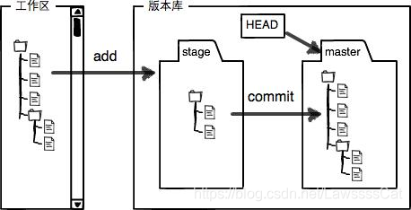

## 索引

1. [创建](#创建)

2. [本地修改](#本地修改)
3. [提交历史](#提交历史)
4. [分支与标签](#分支与标签)
5. [更新与发布](#更新与发布)
6. [合并与重置](#合并与重置)
7. [撤销](#撤销)
8. [工作区，版本库(暂存区-stage，分支-master)图](<#工作区，版本库(暂存区-stage，分支-master)>)
9. [创建与合并分支图](#创建与合并分支)
10. [branches 图](#分支)
11. [git folw](#git-folw)

## 创建

复制一个已创建的仓库

```git
$ git clone ssh://user@domain.com/repo.git
```

创建一个新的本地仓库

```git
$ git init
```

---## 本地修改

显示工作路径下已修改的文件：

```git
$ git status -s
```

显示与上次提交版本文件的不同：

```git
$ git diff
```

把当前所有修改添加到下次提交中：

```git
$ git add .
```

把对某个文件的修改添加到下次提交中：

```git
$ git add -p <file>
```

提交本地的所有修改：

```git
$ git commit -a
```

提交之前已标记的修改：

```git
$ git commit
```

附加消息提交：

```git
$ git commit -m 'message here'
```

修改上次提交

_请勿修改已发布的提交记录!_

```git
$ git commit --amend
```

---## 提交历史

从最新提交开始，显示所有的提交记录（显示 hash， 作者信息，提交的标题和时间）：

```git
$ git log
```

显示所有提交（仅显示提交的 hash 和 message）：

```git
$ git log --oneline
```

显示某个用户的所有提交：

```git
$ git log --author="username"
```

显示某个文件的所有修改：

```git
$ git log -p <file>
```

谁，在什么时间，修改了文件的什么内容：

```git
$ git blame <file>
```

## 分支与标签

列出所有的分支：

```git
$ git branch -a
```

查看本地分支与远程分支的映射关系

```git
$ git branch -vv
```

切换分支：

```git
$ git checkout <branch>
```

创建并切换分支:

```git
$ git checkout <branch>
```

基于当前分支创建新分支：

```git
$ git branch <new-branch>
```

基于远程分支创建新的可追溯的分支：

```git
$ git branch --track <new-branch> <remote-branch>
```

创建本地分支与远程分支做映射

```git
$ git branch -u origin/分支名
```

删除本地分支:

```git
$ git branch -d <branch>
```

删除远程端分支：

```git
$ git push <remote> :<branch> (since Git v1.5.0)
or
git push <remote> --delete <branch> (since Git v1.7.0)
```

给当前版本打标签：

```git
$ git tag <tag-name>
```

## 更新与发布

列出对当前远程端的操作：

```git
$ git remote -v

```
本地更新远程分支列表项:
``` git
$ git branch -a
$ git remote prune origin
```

添加新的远程端：

```git
$ git remote add <remote> <url>
```

下载远程端版本，但不合并到 HEAD 中：

```git
$ git fetch <remote>
```

下载远程端版本，并自动与 HEAD 版本合并：

```git
$ git remote pull <remote> <url>
```

将远程端版本合并到本地版本中：

```git
$ git pull origin master
```

将本地版本发布到远程端：

```git
$ git push remote <remote> <branch>
```

## 合并与重置

将分支合并到当前 HEAD 中：

```git
$ git merge <branch>
```

合并某个分支上的单个 commit:
::: tip
首先，用 git log 或 sourcetree 工具查看一下你想选择哪些 commits 进行合并,
比如 feature 分支上的 commit 82ecb31 非常重要，它含有一个 bug 的修改，或其他人想访问的内容。无论什么原因，你现在只需要将 82ecb31 合并到 master，而不合并 feature 上的其他 commits，所以我们用 git cherry-pick 命令来做

现在 82ecb31 就被合并到 master 分支，并在 master 中添加了 commit（作为一个新的 commit）。cherry-pick 和 merge 比较类似，如果 git 不能合并代码改动（比如遇到合并冲突），git 需要你自己来解决冲突并手动添加 commit。
:::

```git
git checkout master
$ git cherry-pick 82ecb31
```

合并某个分支上的一系列 commits:

::: tip
在一些特性情况下，合并单个 commit 并不够，你需要合并一系列相连的 commits。这种情况下就不要选择 cherry-pick 了，rebase 更适合。还以上例为例，假设你需要合并 feature 分支的 commit76cada ~62ecb3 到 master 分支。

首先需要基于 feature 创建一个新的分支，并指明新分支的最后一个 commit：
git checkout featuregit
git checkout -b newbranch 62ecb3
然后，rebase 这个新分支的 commit 到 master（--ontomaster）。76cada^ 指明你想从哪个特定的 commit 开始。
git rebase --ontomaster 76cada^
得到的结果就是 feature 分支的 commit 76cada ~62ecb3 都被合并到了 master 分支。
:::

将当前 HEAD 版本重置到分支中:

_请勿重置已发布的提交!_

```git
$ git rebase <branch>
```

退出重置:

```git
$ git rebase --abort
```

解决冲突后继续重置：

```git
$ git rebase --continue
```

使用配置好的 merge tool 解决冲突：

```git
$ git mergetool
```

在编辑器中手动解决冲突后，标记文件为已解决冲突:

```git
$ git add <resolved-file>
$ git rm <resolved-file>
```

## 撤销

放弃工作目录下的所有修改：

```git
$ git reset --hard HEAD
```

移除缓存区的所有文件（i.e. 撤销上次 git add）:

```git
$ git reset HEAD
```

放弃某个文件的所有本地修改：

```git
$ git checkout HEAD <file>
```

重置一个提交（通过创建一个截然不同的新提交）:

```git
$ git revert <commit>
```

将 HEAD 重置到上一次提交的版本，并放弃之后的所有修改：

```git
$ git reset --hard <commit>
```

将 HEAD 重置到上一次提交的版本，并将之后的修改标记为未添加到缓存区的修改：

```git
$ git reset <commit>
```

## 工作区，版本库(暂存区-stage，分支-master)




## 创建与合并分支


## 分支


## git-folw


**参考**

[Git Cheat Sheet 中文版](https://github.com/flyhigher139/Git-Cheat-Sheet)

[Git 教程 廖雪峰的官方网站](https://www.liaoxuefeng.com/wiki/896043488029600)
